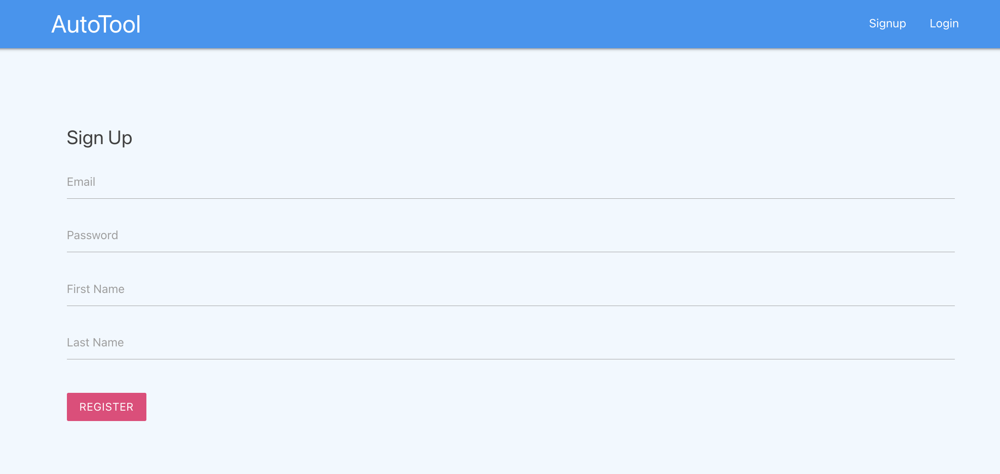
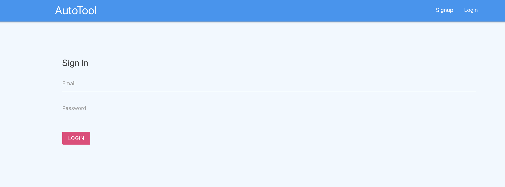

# AutoTool - Project Management Application

AutoTool is a modern web application for managing projects and collaborating with teams. Built with React, Firebase, and Redux, it provides a seamless real-time experience for creating, tracking, and sharing projects.

## Features & Capabilities

### Authentication

- **User Registration**: Sign up with email and create a new account
- **User Login**: Secure sign-in with Firebase Authentication
- **Session Management**: Persistent authentication with automatic redirection for protected routes

#### Sign Up Page

#### Sign In Page

### Project Management

- **Create Projects**: Add new projects with title and content
- **View Projects**: Browse all projects in a centralized dashboard
- **Project Details**: View detailed information about individual projects
- **Project Summary**: Quick overview cards showing project information
- **Real-time Sync**: All changes synchronized across the application instantly

### Dashboard

- **Project Overview**: See all your projects at a glance
- **Notifications**: Real-time notifications for project updates and team activity
- **Quick Navigation**: Easy access to create new projects or view existing ones

### Notifications

- **Project Notifications**: Automatic notifications when new projects are created
- **User Activity**: Get notified when new users join the platform
- **Real-time Updates**: Notifications appear instantly as they're generated

### Backend Infrastructure

- **Cloud Functions**: Automated server-side operations
  - Auto-generate notifications when projects are created
  - Track when new users join the platform
- **Firestore Database**: Scalable real-time database for all application data
- **User Data Storage**: Secure storage of user profiles and project information

### Technical Stack

- **Frontend**: React with Redux for state management
- **Authentication**: Firebase Authentication
- **Database**: Cloud Firestore
- **Backend**: Firebase Cloud Functions
- **Real-time Data**: React Redux Firebase integration
- **Routing**: React Router for client-side navigation
- **Date/Time**: Moment.js for date formatting

## Available Scripts

In the project directory, you can run:

### `npm start`

Runs the app in the development mode. 
Open [http://localhost:3000](http://localhost:3000) to view it in the browser.

The page will reload if you make edits. 
You will also see any lint errors in the console.

### `npm test`

Launches the test runner in the interactive watch mode. 
See the section about [running tests](https://facebook.github.io/create-react-app/docs/running-tests) for more information.

### `npm run build`

Builds the app for production to the `build` folder. 
It correctly bundles React in production mode and optimizes the build for the best performance.

The build is minified and the filenames include the hashes. 
Your app is ready to be deployed!

See the section about [deployment](https://facebook.github.io/create-react-app/docs/deployment) for more information.

### `npm run eject`

**Note: this is a one-way operation. Once you `eject`, you can’t go back!**

If you aren’t satisfied with the build tool and configuration choices, you can `eject` at any time. This command will remove the single build dependency from your project.

Instead, it will copy all the configuration files and the transitive dependencies (webpack, Babel, ESLint, etc) right into your project so you have full control over them. All of the commands except `eject` will still work, but they will point to the copied scripts so you can tweak them. At this point you’re on your own.

You don’t have to ever use `eject`. The curated feature set is suitable for small and middle deployments, and you shouldn’t feel obligated to use this feature. However we understand that this tool wouldn’t be useful if you couldn’t customize it when you are ready for it.

## Learn More

You can learn more in the [Create React App documentation](https://facebook.github.io/create-react-app/docs/getting-started).

To learn React, check out the [React documentation](https://reactjs.org/).

### Code Splitting

This section has moved here: https://facebook.github.io/create-react-app/docs/code-splitting

### Analyzing the Bundle Size

This section has moved here: https://facebook.github.io/create-react-app/docs/analyzing-the-bundle-size

### Making a Progressive Web App

This section has moved here: https://facebook.github.io/create-react-app/docs/making-a-progressive-web-app

### Advanced Configuration

This section has moved here: https://facebook.github.io/create-react-app/docs/advanced-configuration

### Deployment

This section has moved here: https://facebook.github.io/create-react-app/docs/deployment

### `npm run build` fails to minify

This section has moved here: https://facebook.github.io/create-react-app/docs/troubleshooting#npm-run-build-fails-to-minify

### NOTE you will have to use this particular npm due to updates not supported

`npm i --save react-redux@5.1.1 react-redux-firebase@2.2.4`
